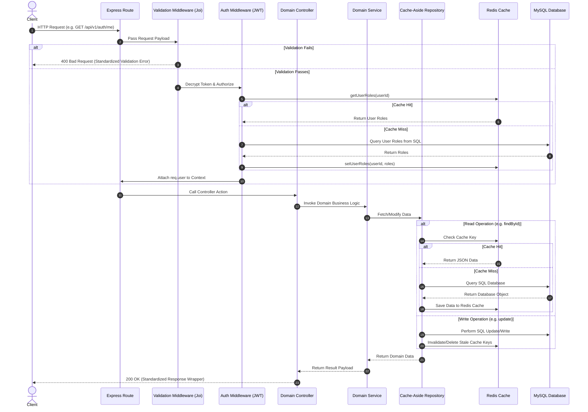

# Architecture Overview

This document provides a comprehensive overview of the Mandal backend architecture, the recommended tech stack, and the request lifecycle. The system is designed using clean architecture and Domain-Driven Design (DDD) principles to ensure scalability, security, high performance, and testability.

---

## 1. Directory Structure & Architecture Layers

The codebase is organized into distinct layers to separate concerns:

```
src/
├── api/                  # API Delivery Layer (HTTP Routes, Controllers, Middlewares)
│   ├── v1/               # Version 1 (Authentication, Mandals, Finance, etc.)
│   └── v2/               # Version 2 (Future updates/routes)
├── domains/              # Core Domain Business Logic Layer
│   ├── auth/             # Authentication & User Management Domain
│   ├── finance/          # Contributions, Loans, and Payments Domain
│   └── mandal/           # Community Mandal & Membership Domain
├── infrastructure/       # Interfaces to Databases, Caching, Queues, and External APIs
│   ├── cache/            # Redis Caching Connection and Services
│   ├── database/         # MySQL models, Sequelize setup, and migrations
│   ├── external/         # Payment (Razorpay), SMS (Twilio), Email (Nodemailer)
│   └── queue/            # Asynchronous Task Queues (BullMQ)
├── core/                 # App-wide global structures (Error handler, etc.)
└── utils/                # Helper utilities (Cron scheduler, Logger, etc.)
```

### Architectural Principles:
1. **Separation of Concerns**: Delivery mechanisms (API/HTTP) are separated from core business rules (Domains), which are separated from data storage and external systems (Infrastructure).
2. **Repository Pattern**: Business logic interacts with databases through abstraction layers (Repositories) rather than direct Sequelize model calls, allowing us to seamlessly introduce caching.
3. **Cache-Aside Caching**: High-frequency read paths are intercepted by Redis, which falls back to MySQL on cache misses and automatically invalidates cached data on database writes.

---

## 2. Recommended Tech Stack

The project relies on a modern, robust, and highly scalable Node.js technology stack:

| Component | Technology | Purpose |
| :--- | :--- | :--- |
| **Runtime & Framework** | Node.js (v18+) & Express | Core application server and HTTP router. |
| **Primary Database** | MySQL (v8.0) | Relational database to maintain ACID consistency for financial transactions (contributions, loans). |
| **Object-Relational Mapper** | Sequelize ORM | Schema mapping, database migrations, and structural relationships. |
| **Cache & Session Store** | Redis (v7.0) | High-speed cache for profiles, authorization roles, and background queues. |
| **Task Queue** | BullMQ | Distributed task and job queue running on Redis for non-blocking notification delivery. |
| **Security & JWT** | JSON Web Tokens & Bcrypt | Stateless API access security and secure cryptographic password/token hashing. |
| **Validation** | Joi | Declarative schema validation for request bodies, parameters, and queries. |
| **Structured Logging** | Winston | Contextual JSON logger with date-based rotation for tracking operations. |
| **Cron Scheduling** | node-cron | Periodic batch operations (weekly/monthly/yearly contribution dues generation). |
| **Containerization** | Docker & Kubernetes | Containerized replication, cluster management, config maps, and cloud ingress routing. |

---

## 3. Request Lifecycle

The diagram below illustrates how an HTTP request flows through the Mandal backend, highlighting the validation, authentication caching, domain logic execution, and database caching boundaries.



### Detail of Lifecycle Steps:
1. **Ingress (Express Route)**: The client's HTTP request arrives at the server. Routes are parsed and matched against defined paths (e.g., `/api/v1/auth/me`).
2. **Request Validation**: The payload is run against a Joi schema. If it contains invalid parameters, the request is immediately rejected with a standardized `VALIDATION_ERROR` response payload.
3. **Authentication & Authorization (Cache Hit/Miss)**:
   - The Authorization header (Bearer JWT) is parsed.
   - The token is decrypted and verified.
   - The system checks if user roles are cached in Redis. If yes, it skips database lookup. If no, it queries roles from MySQL and saves them to Redis.
   - User profile and active status are verified.
4. **Domain Controller**: The controller acts as an orchestrator. It extracts arguments, invokes the appropriate Domain Service, and handles the formatting of success/error HTTP outputs.
5. **Domain Services (Business Logic)**: Houses core business processes (e.g., generating OTP tokens, verifying otpRef hashes, and computing loan amortization).
6. **Repository Layer (Caching Interface)**:
   - For reads, it checks Redis using designated cache-aside key namespaces (e.g. `cache:user:id:123`). If present, it deserializes the cache and returns it. If missing, it fetches it from MySQL, registers it to Redis with a 1-hour TTL, and returns it.
   - For updates, inserts, or deletes, it writes directly to MySQL first, and then triggers automatic invalidation of associated keys in Redis to prevent reading stale data.
7. **Response Outflow**: The controller wraps the successful result in a standard response wrapper `{ success: true, data: ... }` and sends it back to the client. Any thrown errors are caught by the global `errorHandler` middleware and mapped to standardized error payloads.